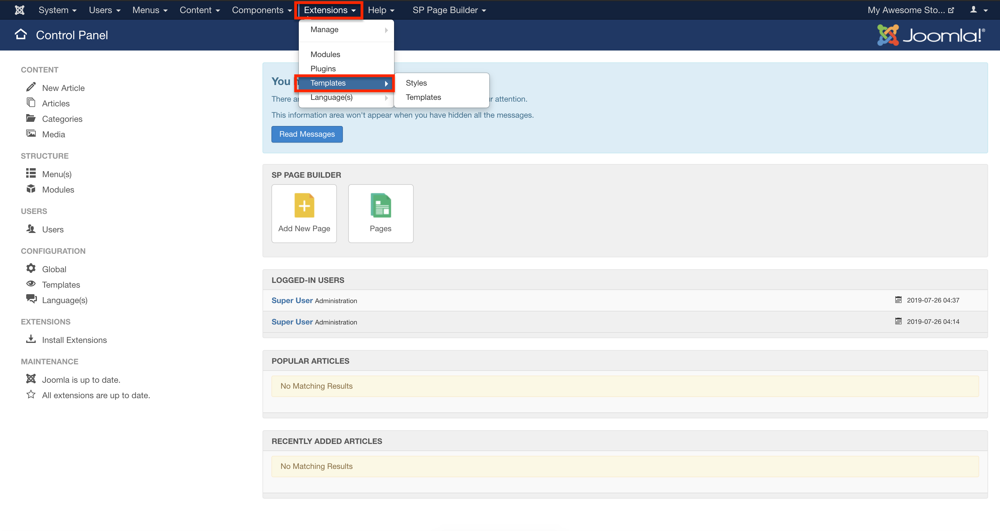
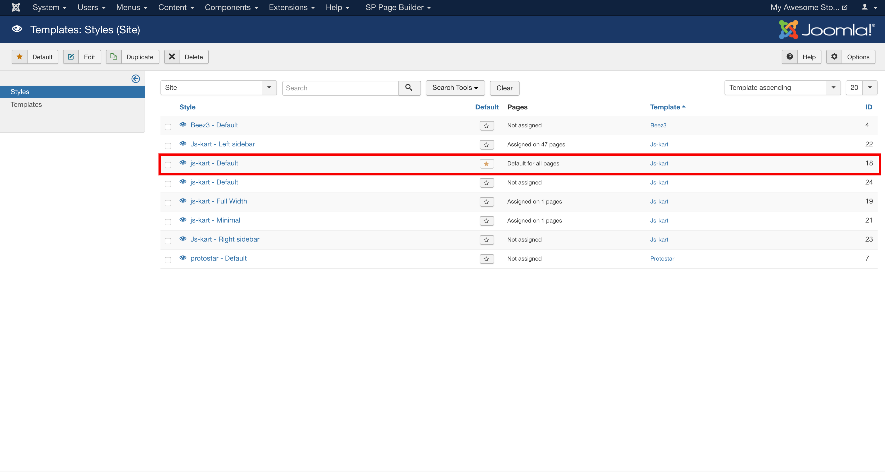
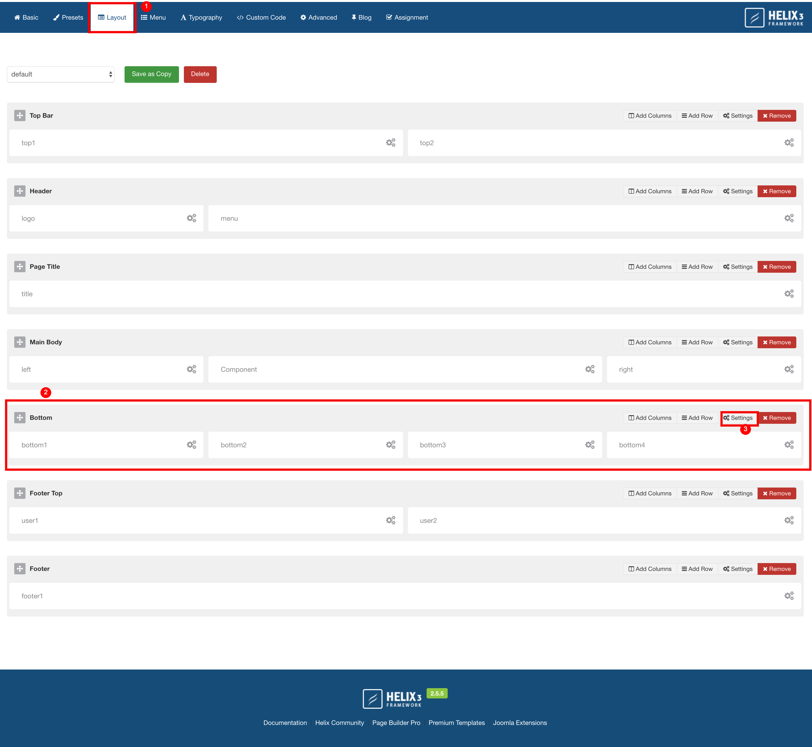

To change the image/color in sellacious templates: 

1. Go to Joomla Administrator > Extensions > Templates. 

2. Click on the template you're using or in which you want to change the footer. In this documentation we're using Js-Kart template.

> There can be more than one layouts/styles which are using in your templates. Like in the above screen shot, Js-kart have 4 layouts. Default, Left Side Bar, Minimal and full width. Make sure to update the footer in all the layouts you're using, not just default layout.

3. Go to Layout section and click on Settings to edit the Bottom 'Row'. 

4. Change the Background Image/Color and save.