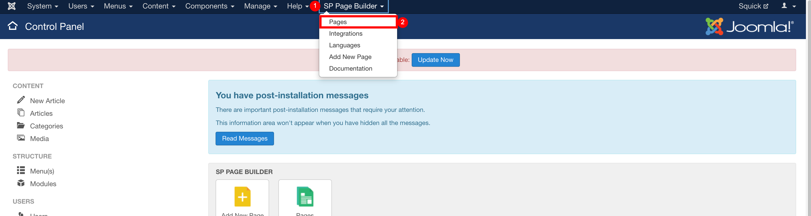
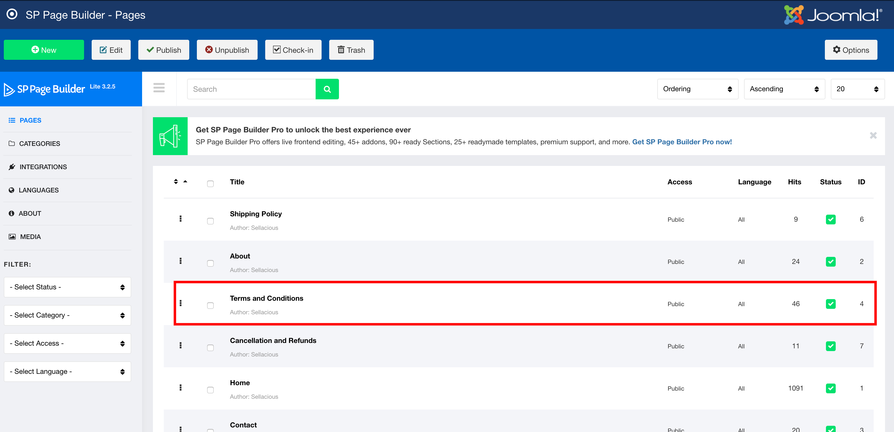
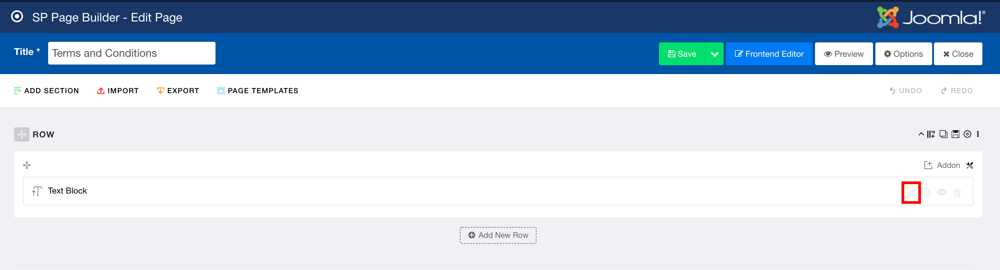
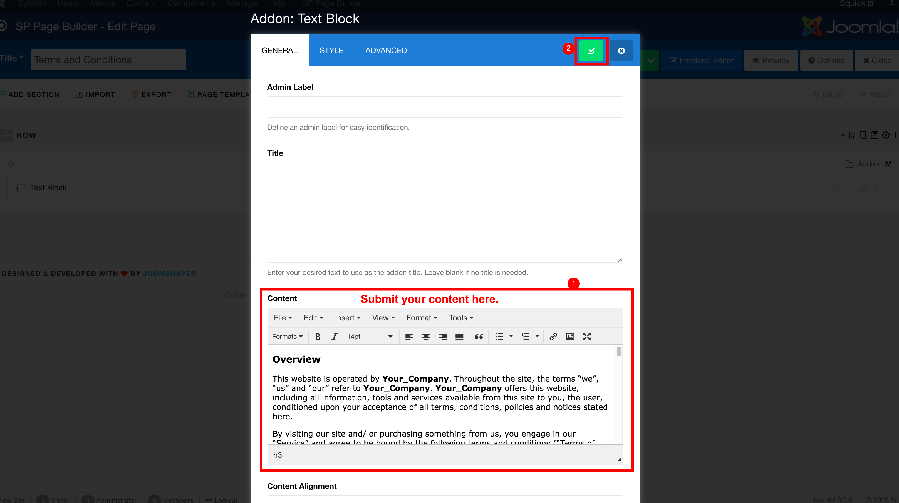
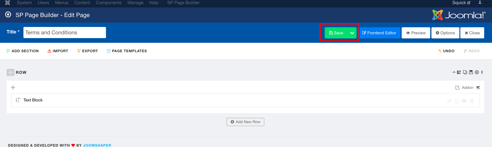

Editing the Terms & Conditions in your template is easy. To edit them go to Joomla administrator. You can access Joomla administrator by http://yoursite.com/administrator.  

1. Go to SP Page Builder > Pgaes.  

2. Click on the page you want to edit. In this doc we are editing the page terms & conditions. You can edit Shipping Policy, Refund Policy, Contact Us page and many more in the same way.  

3. Click on the edit icon in addon. Usually, There's only one addon of Text Block, If there are more, make sure to edit the correct one.  

4. Addon will open. You submit your text and apply it.  

5. Save the page.

6. You can see your changes in frontend.  
7. You can change the other pages similarly.  