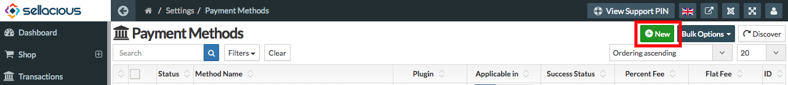

##### **Introduction**

Instamojo is India's e-commerce business allowing payments and money transfers to be made through the Internet. We need to configure API key and Auth Token to receive payment for this plugin.  
Instamojo has two environments for transaction Live and Sandbox(Test Mode). Sandbox environment used to test transactions before going live that will only create dummy transactions. Live environment is actual environment where all transactions are not dummy and paid actually.

##### **Live Environment**

For Live environment you need to use your Instamojo account API Key as  'API Key(Live)'  and Auth Token as 'Auth Token(Live)' in plugin configuration. And select Live in 'Transaction Mode'.

##### **Sandbox Environment**

For Sandboxenvironment you need to use your Test Instamojo account API Key as  'API Key(Sandbox)'  and Auth Token as 'Auth Token(Sandbox)' in plugin configuration. And select Sandbox/Test Mode in 'Transaction Mode'.  
To get Sandbox or Live API Key and Auth Token (credential) we need to create account as Instamojo. For getting Live credentials you need to create your account at https://www.instamojo.com/ and for Sandbox credentials create account at https://test.instamojo.com/.

**In following steps we will see how to create sandbox account and get credentials. For Live account will be same process except URL to register account.**

**Step-1:** First of all go to test Instamojo and go to Sign Up Page. https://test.instamojo.com/accounts/register/ and login or if you have already account in Instamojo then login https://test.instamojo.com/accounts/login/

**Step-2:** Once you login to your account you will redirect to your dashboard.https://test.instamojo.com/dashboard/ Here click on 'API & Plugins' from left panel.

**Step-3:** On this page you will obtain 'Private API Key' and 'Private Auth Token under 'Integration Settings'. These are the credentials we need to use to configure plugin.
 

 
Obtaining Instamojo Credentials for Live or Sandbox is very easy. Now we will see how to install and create payment method for this plugin.
 
**Step-1:** Go to administrator panel of your site (yourdomain.com/administrator) and install plugin zip from Joomla Installation.

 
**Step-2:** Go to Extensions > Plugins. Search for 'sellacious payment'. You will see 'Sellacious Payment - Instamojo' in list. Open it to enable and add credentials.
 

 
**Step-3:** Enable plugin and add your sandbox or live credentials and save it.
 

 
**Step-4:** To create payment method login to your site 'Sellacious admin' panel (yourdomain.com/sellacious) or you can also login Sellacious admin panel from Components > sellacious > Launch Sellacious.
 
**Step-5:** In Sellacious admin panel go to Settings > Payment Methods from left menu
 

.
**Step-6:** Click on New to create payment method.
 

**Step-7:** Now need to fill all required fields as listed:
 
1. **Plugin:** Select Instamojo from Plugin drop down. 
2. **Transaction Details:** Select 'Sandbox/Test Mode' if you are going to set for testing transaction and 'Live'        for actual transactions. Add your sandbox API Key as 'API Key(Sandbox)' and Auth Token as 'Auth                      Token(Sandbox)'. Your    Live API Key as 'API Key(Live)' and Auth Token as 'Auth Token(Live)'. 
3. **Shopping Cart:** If this type of payment method is make using this plugin, this payment method will be   
     available only for Sellacious cart. 
6. **Add Fund to E-Wallet:** If this type of payment method is make using this plugin, this payment method will be        available only for adding fund in e-wallet. 
You can select both 'Shopping Cart' and 'Add Fund to E-Wallet' that will be available for both the places. Then save payment method.
 

 
That's it to configure Instamojo with Sellacious Payment Cart or to use as Add Fund to E-Wallet

