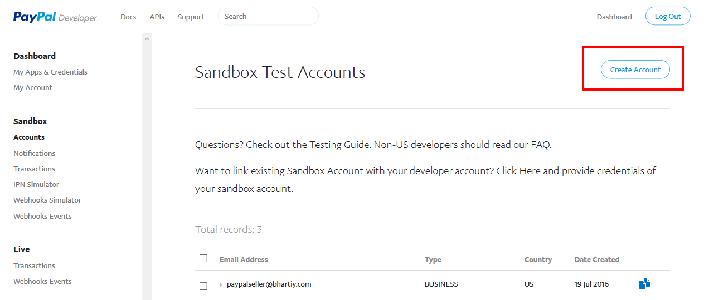

##### **Introduction**

**PayPal** is an American international e-commerce business allowing payments and money transfers to be made through the Internet. PayPal Standard payment gateway allows to pay with Business ID. No need to configure Key and secret to receive payment for this plugin.  
PayPal Standard has two environments for transaction Live and Sandbox(Test Mode). Sandbox environment used to test transactions before going live that will only create dummy transactions. Live environment is actual environment where all transactions are not dummy and paid actually.
 
##### **Live Environment**

For Live environment you need to use your PayPal Business ID as 'Receiver PayPal Email(Live)' in plugin configuration. And select Live in 'Transaction Mode'.

##### **Sandbox Environment**

For Sandbox environment you need to create a sandbox business account from PayPal Developer. For this you can use PayPal account login in PayPal Developer if you have or create new PayPal Developer account. Then login here https://developer.paypal.com/ to create sandbox credentials. We need test account and App in developer account. 
**Step-1:** First of all go to developer dashboard. https://developer.paypal.com/developer/applications/.

**Step-2:** Click 'Accounts' from left panel Under Sandbox (marked as 1 in below screenshot). https://developer.paypal.com/developer/accounts/

**Step-3:** From here you can create account or if you want to continue with already exist account from list then can skip this step. For this account make sure the country you selected supports receiving payment. Check https://developer.paypal.com/docs/integration/direct/rest-api-payment-country-currency-support/ for supported list.

- Then fill form and create new account.

**Step-4:** Now we need to create APP. For that click on 'My Apps & Credentials' from left panel Under Dashboard (marked as 2 in step-2 screenshot). https://developer.paypal.com/developer/applications From here click on Create App button.

- Then fill form and click button to create it.

**Step-5:** Now you can use this Sandbox Account email as 'Receiver PayPal Email (Sandbox)' in plugin configuration. And select Sandbox/Test Mode in 'Transaction Mode'.

Non-US developers should visit this https://developer.paypal.com/docs/faq/#international-developer-questions

Now we will see how to install and configure in Sellacious.

**Step-1:** Go to administrator panel of your site (yourdomain.com/administrator) and install plugin zip from Joomla Installation. In most cases, You don't need to follow this step because Sellacious comes in-built with Paypal Standard Plugin installed.

**Step-2:** Go to Extensions > Plugins. Search for 'sellacious payment'. You will see 'Sellacious Payment - PayPal Standard' in list. Open it to enable and add credentials.

**Step-3:** Enable plugin and add your sandbox or live credentials and save it.

**Step-4:** To create payment method login to your site 'Sellacious admin' panel (yourdomain.com/sellacious) or you can also login Sellacious admin panel from Components > sellacious > Launch Sellacious.

**Step-5:** In Sellacious admin panel go to Settings > Payment Methods from left menu

**Step-6:** Click on New to create payment method.

**Step-7:** Now need to fill all required fields as listed:

1. **Plugin:** Select PayPal Standard from Plugin drop down.
2. **Transaction Details:** Select 'Sandbox/Test Mode' if you are going to set for testing transaction and 'Live'        for actual transactions. Add your sandbox account Id as 'Receiver PayPal Email (Sandbox)' and your PayPal            Business Id as 'Receiver PayPal Email (Live)'.
3. **Shopping Cart:** If this type of payment method is make using this plugin, this payment method will be              available only for Sellacious cart.
4. **Add Fund to E-Wallet:** If this type of payment method is make using this plugin, this payment method will be        available only for adding fund in e-wallet.

You can select both 'Shopping Cart' and 'Add Fund to E-Wallet' that will be available for both the places. Then save payment method.

