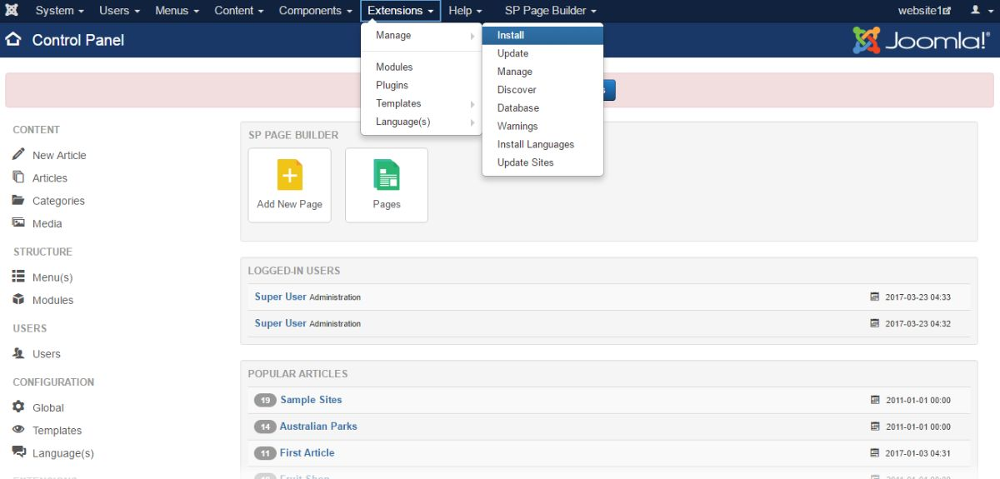

##### **Learn how to setup PayPal pro payment method for your store's transactions using PayPal pro plugin.**

1. First of all, go to sellacious.com/apps-and-integrations then navigate to PayPal in Payment Integration section.    Click on See Details button to know about different PayPal plans.

2. Purchase any of the plugin plan to download the PayPal pro plugin.

3. After downloading the plugin, go to Joomla administration panel of your website. Go to Extensions and click on      Install from the dropped down menu.

4. Click on Upload Package File and upload & install the downloaded PayPal plugin.

5. Go to Extensions and click on Plugins from the dropped down menu. Search for the plugin you installed and enable it by clicking on Enable button after selecting the plugin.

6. Once the plugin is enabled, go to Sellacious admin panel of your website. Navigate to Settings and click on Payment Methods from the dropped down list.

7. Click on New button to create a new payment method using PayPal pro.Fill the details of the new payment method in Payment Method[edit] section.

8. Set different options available in Payment Method, Credit System, Transaction and Connection sections. For having real transactions through your PayPal account, you have to select Live Mode as the transaction mode and enter the API keys for live transactions.  
9. To get the Live API key and Secret API key, go to developer.paypal.com. Sign-in to your PayPal account and go to Dashboard.

10. Now, click on Create App to create your LIVE transaction API keys.

11. After creating the app, you will get the API keys for your account's LIVE transactions.

12. Enter the API key and Secret API key for LIVE transaction mode in Payment Method[edit] section.

13. Save the payment method information. Your new payment method is ready for transaction.

 