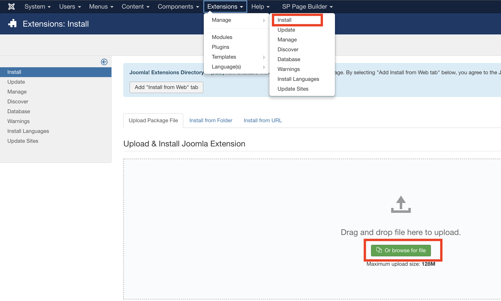
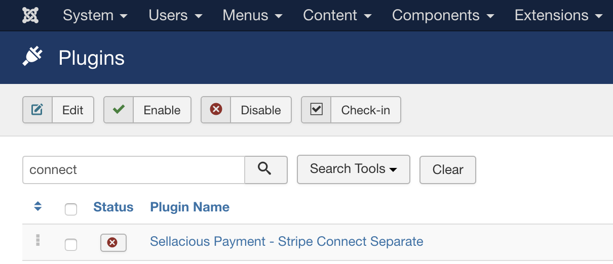
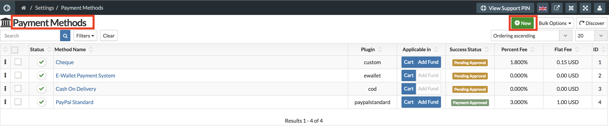

**[Stripe Connect](https://stripe.com/docs/connect)** is a full-stack solution for using Stripe’s capabilities on behalf of others. Connect provides a powerful API and other tools you need to make charges, as well as onboard, verify, and pay sellers, contractors, service providers: whomever business’s users are.

With the help of this plugin, the purchase amount directly goes to the seller's Stripe Connect account.

To configure the Stripe connect plugin, you need to install and enable the plugin in your site. You can download the plugin from [https://www.sellacious.com/p/sellacious-extensions/payment-plugins/stripe-connect](https://www.sellacious.com/p/sellacious-extensions/payment-plugins/stripe-connect).

To install this plugin go to the Joomla administrator > Extensions. Now go to Manage and Install. Select upload the package option, install the package you downloaded.

You can enable the plugin from Joomla Administrator > Extensions > Plugins. Search for this plugin and enable it.

Now, to configure this plugin go to Sellacious administrator > Settings > Payment Methods. Click on New.

Select the Plugin Stripe Connect. Submit method name and after that fill the information related to you Stripe Account such as Client Key, Publishable Key, and Secret Key. [https://stripe.com/docs/keys](https://stripe.com/docs/keys)
Save the settings. Go to your Stripe Account and configure the Redirect URL. To redirect Sellers to back to their profile page URL should be

[http://yoursite.com/sellacious/index.php?option=com_sellacious&view=user&layout=edit&redirected_by=stripeconnectseparate](http://yoursite.com/sellacious/index.php?option=com_sellacious&view=user&layout=edit&redirected_by=stripeconnectseparate)

and

[http://yoursite.com/sellacious/index.php?option=com_sellacious&view=profile&layout=edit&redirected_by=stripeconnectseparate](http://yoursite.com/sellacious/index.php?option=com_sellacious&view=profile&layout=edit&redirected_by=stripeconnectseparate)

First URL is to redirect when an admin connects seller's account and the second URL is to redirect when a Seller connects from his own profile.

To connect a seller's account to your shop, open their profile (sellers can edit their profile), go to Seller's Info. At the bottom, you'll see the option to connect Stripe Account. Click on the button 'Click to Connect with - Stripe Account' and page will open Connect a Stripe Account. Once the account is connected, it'll redirect you to the one of the above URL (based on your profile).