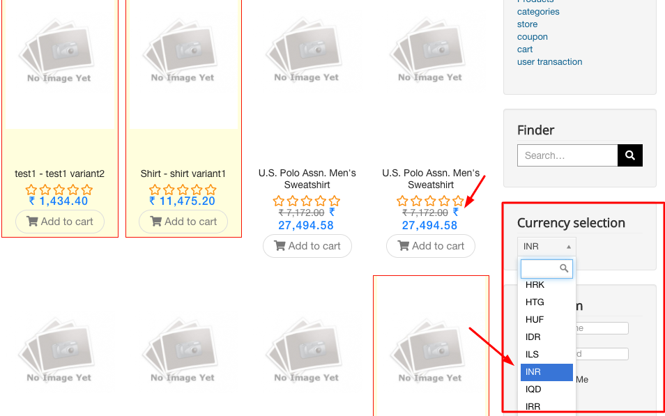

This provides a list of avaialble currencies to the the user to set display currency for frontend.

 **Show title:** You can select to show or hide the module title on frontend. Show button will show the title of the module and Hide button will hide the title of the module.
 **Position**: It represents the position of the module. You can choose the position from the drop-down list.
 **Status**: The status represents the module is published or unpublished from the front end.

**Menu Assignment**: You can choose where you want to show the module. You can select any one of the option from here:
1. On all pages
2. No. of pages
3. Only on pages selected
4. On all pages except selected
