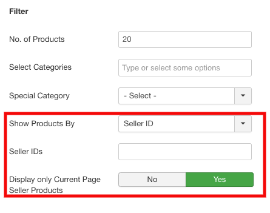

**Written By**: Rashi Gupta
**Date**: 5-06-2020
**Compatibility**: Sellacious v2.0.0-Beta1+

Sellacious Product Module will display all Type of product. When publish the sellacious product module, it will show on fontend like this:

Following type of Product modules can be created using this-

You just need to select a particular type and change some configuration accordingly.

**1. Latest:**  In Latest product type, only latest product will be shown in module i.e. only those products which have been created recenlty.

**2. Related:** In Related product type, only related products is shown on frontend. You can select in whose relation you'd like to display products for. In related product, two filters is added. Both related products for:
a. Both from active product detail page and selected below
b. product on active product detail page
c. Selected products below

**3. Bestselling:**  In Bestselling product type, bestselling products will be shown on frontend.

**4. Recently Viewd:** This option shows a user the products he viewed recently. If the user just visited the website and have no viewing history the module will not show any products. This module requires “Sellacious Recent Viewed Product Tracking” to be installed to record user viewing history in temporary browser cookie. If the plugin is not installed, the module will not work.

**5. Seller Specific:** If no IDs are entered, and if Display only Current Page Seller Products is selected as No, then random products will be shown wherever the module is published.

**6. Special Category:** This option displays Special category products. Products of the selected special category will be displayed in front end.

Other than above these are common configurations-
**Basic:**
**Section Title**: Section title is showing in frontend on product module.
**Section Description**: Section description is showing below the section title in frontend on product module.

**Layout Options:**
**Layout**: We have three types of layout: 1.Grid 2.Carusel 3.List
**Product Block Layout**: You can choose which product block you want to show for this module. We have 5 Layouts: 
1.Default 2.Elegant 3.Jskart 4.Minimal 5.Travelkit

**Filter:**
**Number of Products**: You can set the number of product you want to show in module.
**Select Categories**: You can select categories from which you want to show products in module.
**Special Category**: You can select one special category to show the products first in the Module.

**Options:**
**Standout Special Category Products**: If you want products which have special categories to stand out in the module select YES.
**Product Feature List**: If you want to show feature list of products on frontend you can select YES.
**Display Ratings**: Whether you want to show display ratings of product on frontend.
**Compare Button**: In module, you have option to show compare button on products in frontend.
**Add to Cart Button**: In module, you have option to show add to cart button on products in frontend.
**Buy Now Button**: In module, you have option to show Buy now button on products in frontend.
**Show price of products**: In module, you have option to show price of products in frontend.
**Quick View Button**: In module, you have option to show quick view button on products in frontend.
