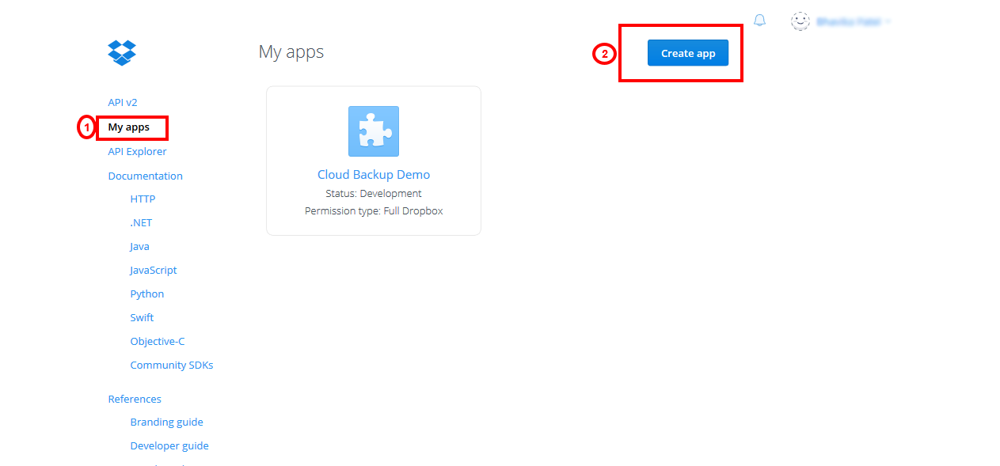
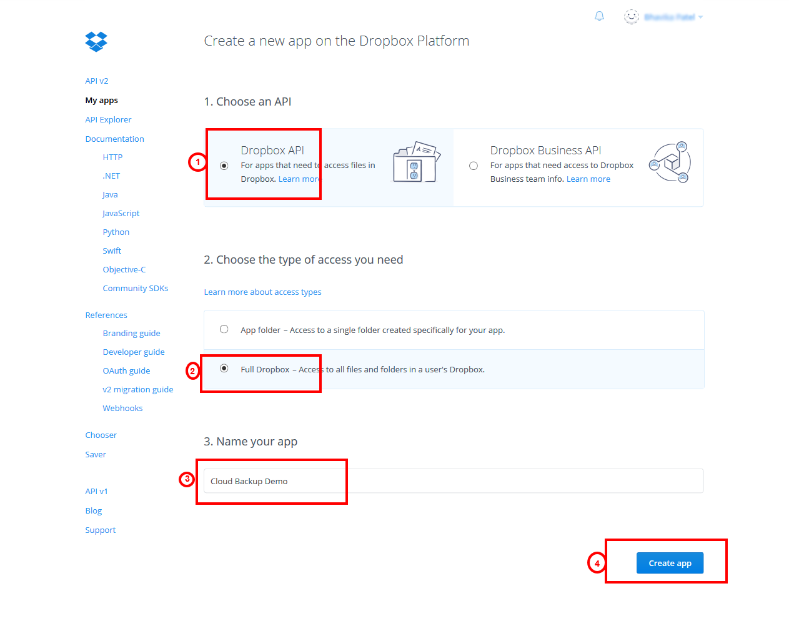
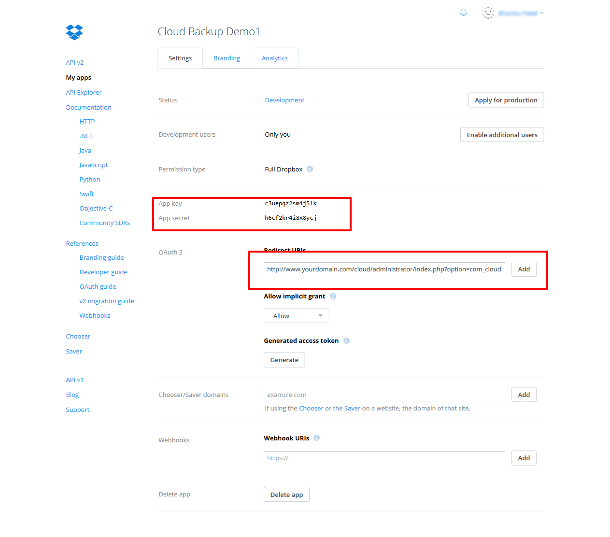
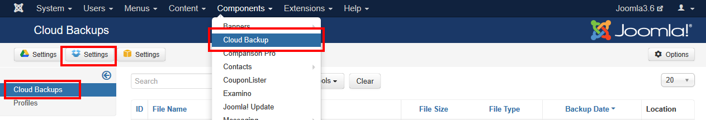
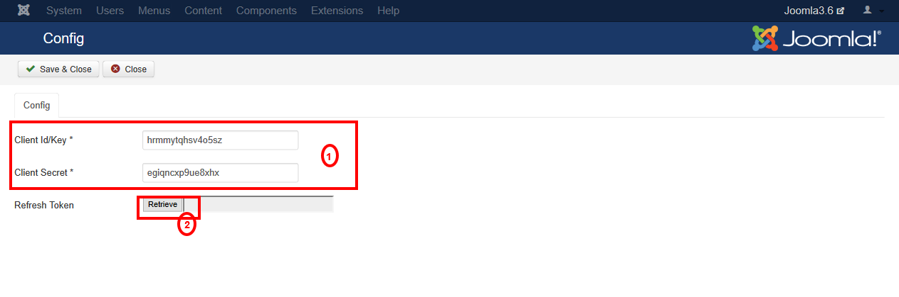
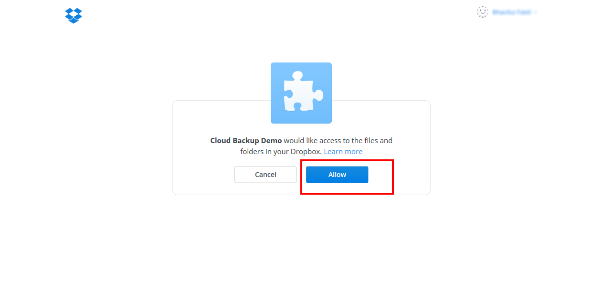
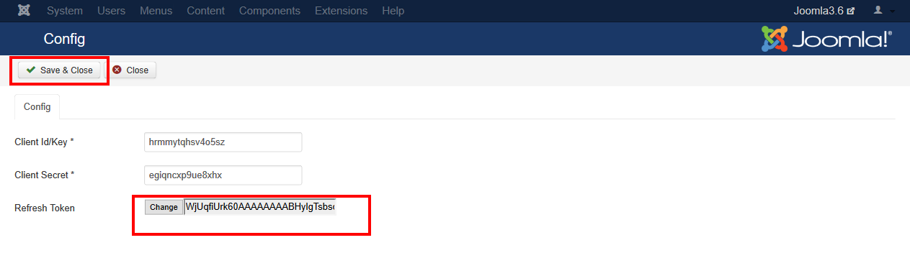
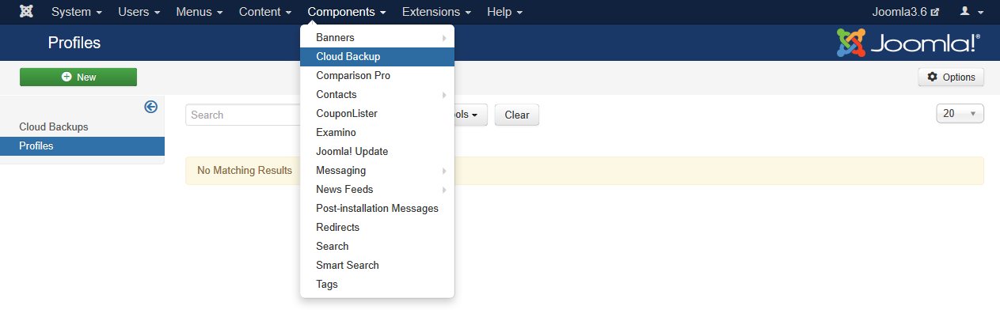
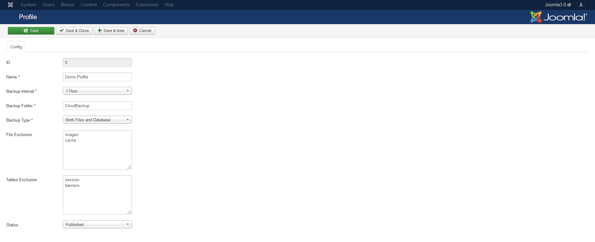

##### **Introduction**

Dropbox is a Cloud Backup plugin that is used to store backup your site and database to your Dropbox. To use it you need to install Cloud Backup component and Cloud Backup system plugin.

##### **Configure Dropbox API**

To store your backup to Dropbox you will need to create an APP at Dropbox. After it you will get the API keys that will be used for configuration of the Cloud Backup Extension.

**STEP-1:** First of all go to Dropbox APP console: https://www.dropbox.com/developers.

click on My apps and create app button.

**STEP-2:** Then select Dropbox API in 'Choose an API', Full Dropbox in 'Choose the type of access you need', enter APP name and click create button.

**STEP-3:** Now you will get App Key and App Secret that will be used in app configuration. Then you need to enter Redirect URIs in OAuth2. This is Very Important Part as it control API permission.

Redirect URI should be like this: http://www.yourdomain.com/cloud/administrator/index.php?option=com_cloudbackup&task=config.receivetoken

This is done for Dropbox API. Now need to configure Cloud Backup API access.

Configure Cloud Backup API access 
Follow these steps to configure your Cloud Backup access: 
**STEP-1:** Go to admin panel of your site yourdomain.com/administrator. Go to Components > Cloud Backup. Click on Dropbox Setting.

**STEP-2:** Enter your App key and secret and click on Retrieve button to get Dropbox token.

This will redirect you to Dropbox API Request Authorization page to allow to store your files in your Dropbox.

Click Allow to get token.

Dropbox access API is configured to Cloud Backup. Now we need to create profile for backup.

##### **Configure Cloud Backup Profile**

Cloud Backup will create a backup of your site and database for that we required to create profile with required settings. 
STEP-1: Go to Components > Cloud Backup > Profiles.

Then Fill all required fields as your requirement.

1) Enter your profile name. 
2) Select backup interval from the list. 
3) Select the type of backup, i.e. Database only, Files only or Both Files and Database. 
4) Enter the name of destination folder on Cloud storage (e.g. Cloud Backup Demo). 
5) Files and folders that should be excluded from the backup done with this profile. 
Each files and folders specified here should be separated with a new line. 
The file and folder names should be all relative to your Joomla site root (where the main index.php
is located). For example: 
images 
cache 
6) Tables that should be excluded from the backup done with this profile. 
For example: 
session 
banners 
7) Then click Save & close to save profile.

Now it will take backup as you set interval on your Dropbox in given Folder.

You can also download backup files stored in Dropbox from Cloud Backups view.