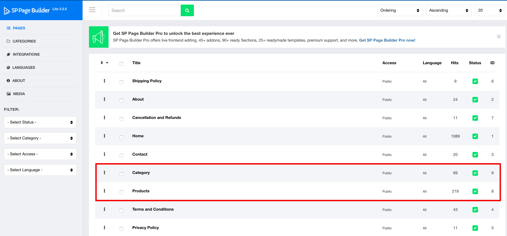
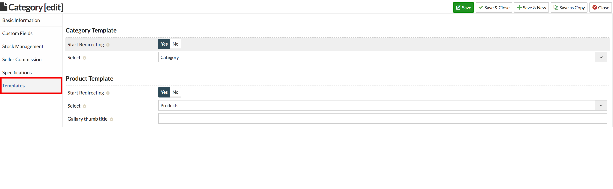
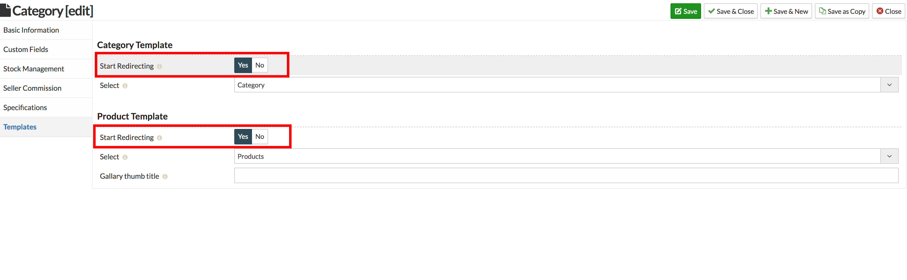
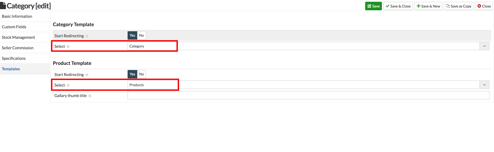

## Sellacious Cateogory Template Plugin

This plugin helps you to use SP Page builder designed Product and category pages in sellacious. To use this plugin you need to [create pages with SP Sellacious addons](https://www.sellacious.com/documentation-v2#/learn/sp-page-builder/setting-up-sp-sellacious-add-ons).

> **To use this Feature of sellacious, it's important to install SP page builder first. All sellacious templates quickstarts already have the SP Page builder.**

You can assign SP Page builder design to sellacious products and categories in two ways.

**1. From Global Configuration:** If you configure this setting, selected pages will be assigned to all the products/categories in your site.

* Go to Sellacious Backend > Settings > Global Configuration > SPPB Template Tab.

* Allow redirection to use sellacious SP Pages.

* Select the pages you created and save these settings.

* You can see your assigned layout on your site.

---

**2. From Categories:** If you don't want to assign the layout to all product in your site but only of one or more category, you can do that from categories. 

* Go to Sellacious Backend > Categories > Physical/Electronic Categories.

* Click on the category to which you want to assign the layout. In this documentation we will select category _T-shirts_.
* Go to template tab.

* Allow redirection to use sellacious SP Pages.

* Select the pages you created and save these settings.

* You can see your assigned layout on your site.

