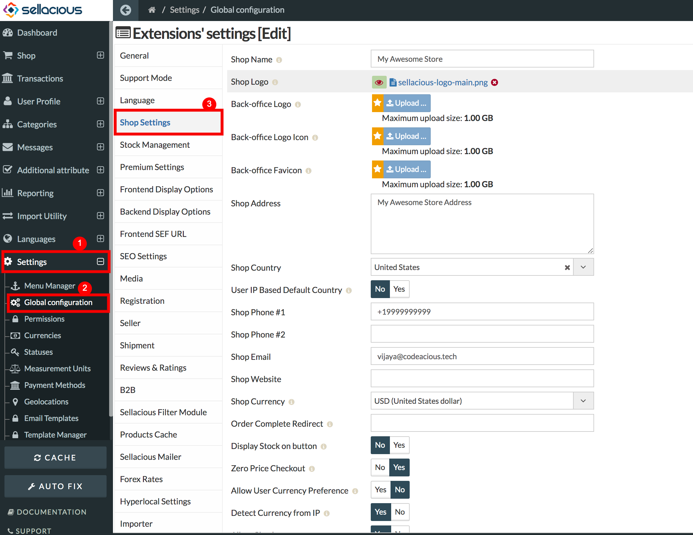
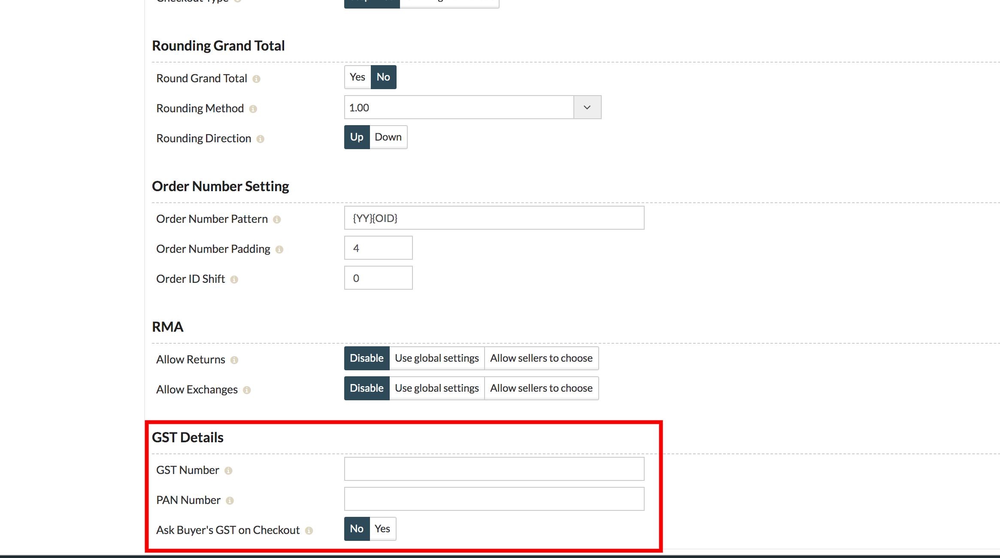
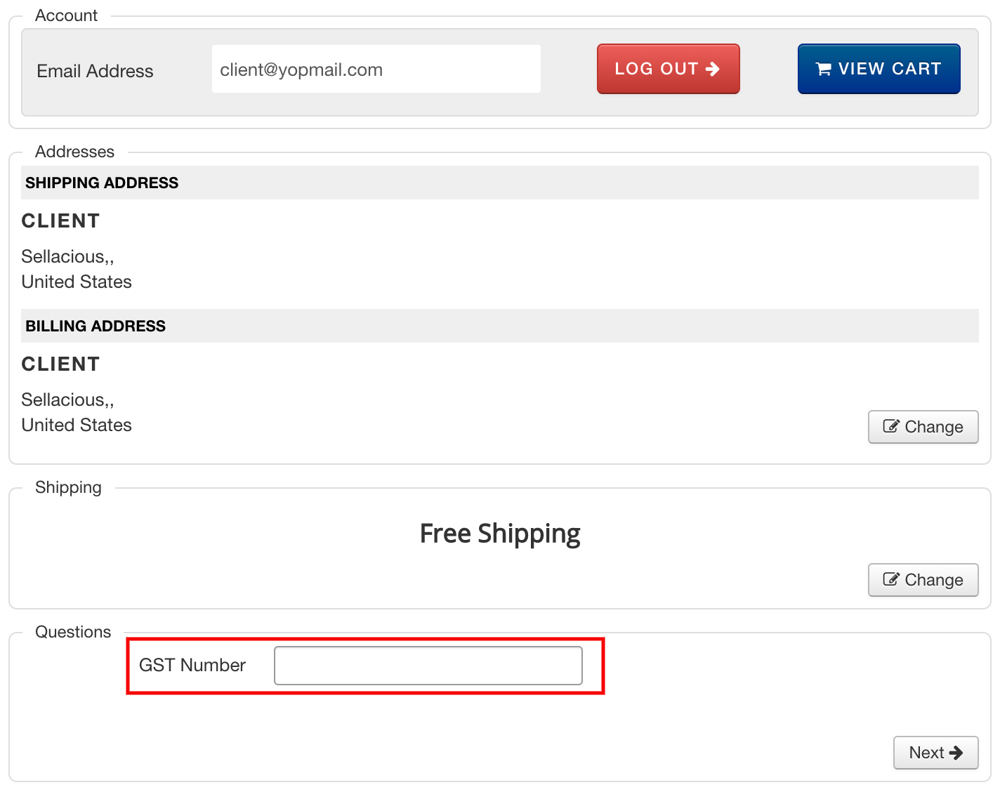

Sellacious GST plugin is for mainly Indian users. With the help of this plugin, you can handle the GST details like a professional.  

You can download this plugin from here https://www.sellacious.com/p/buy-sellacious/gst.  

After installing this plugin, enable this plugin from Joomla administrator > Extensions > Plugins. After enabling the plugin, go to sellacious backend.

You can submit your Shop GST, PAN#. To do this:  

* Go to Sellacious Backend > Settings > Global Configuration > Shop Settings.  

* Scroll to last and you'll see the section for GST details.  

You can also ask your buyer to submit the GST details. If the option **Ask Buyser's GST on checkout** is enabled, buyer can submit their GST details while purchasing product. 

