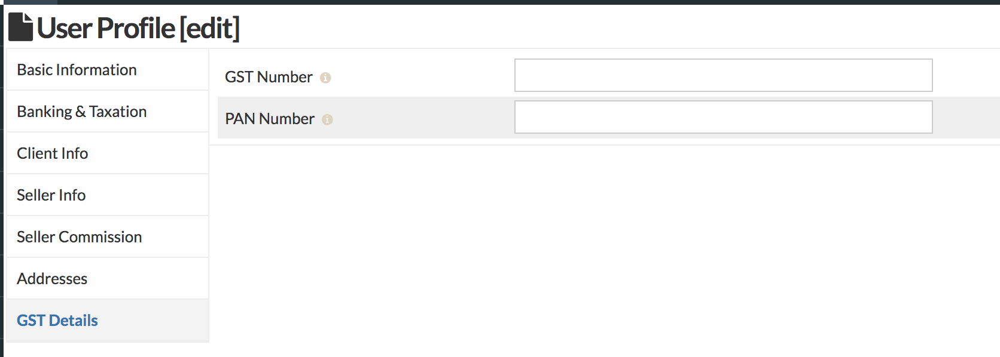
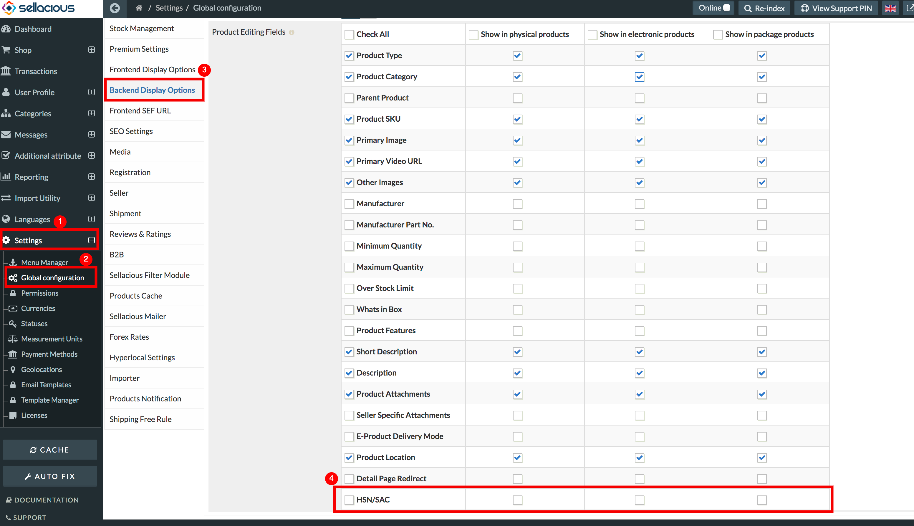
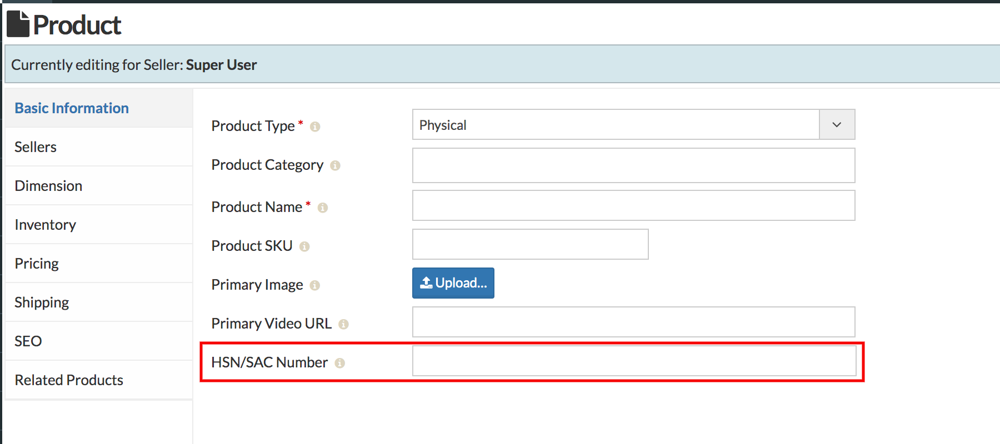
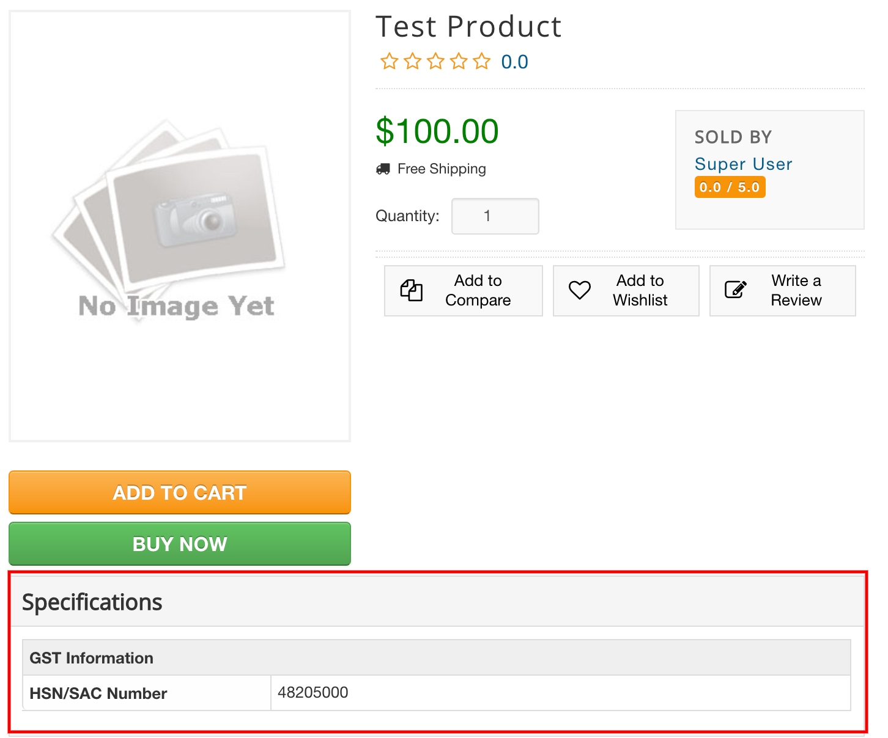

Sellacious GST plugin is for mainly Indian users. With the help of this plugin, you can handle the GST details like a professional.  

You can download this plugin from here https://www.sellacious.com/p/buy-sellacious/gst.  

After installing this plugin, enable this plugin from Joomla administrator > Extensions > Plugins. After enabling the plugin, go to sellacious backend.

## Shop GST details:

* Go to Sellacious Backend > Settings > Global Configuration > Shop Settings.  

* Scroll to last and you'll see the section for GST details.  

## Buyer GST details:

You can also ask your buyer to submit the GST details. If the option **Ask Buyser's GST on checkout** is enabled, buyer can submit their GST details while purchasing product. 

## Seller GST details:

In sellacious, your seller's can also submit their GST details. To submit the seller's details go to Sellacious Backend > User Profile > Sellers. Open any profile and you can view the GST details. Seller's can submit these GST details from their profile.

## HSN/SAC# for products:

To enable this option for your products, go to Sellacious Backend > Settings > Global Configuration > Backend Display Options. Check the HSN/SAC # to enable it in product edit layout.

You can submit this code while creating a product. https://www.sellacious.com/documentation-v2#/learn/product/add-a-product

Users can view this number on your site (Product details page).

## GST Orders and Invoices:

Sellacious comes with inbuilt template manager, which allows you to 