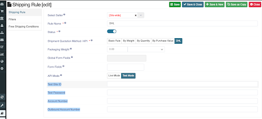

**Configuration**

**Installation:** Install provided plugin from joomla backend->manage->extensions->install. Once installed, enable it.

for DHl Express

**Shipping rule:** when plugin is enabled you will get the option to select dhl api during shipping rule creation. Create shipping rule and save api credentials which are 
Site ID, Password, Account Number, Outbound Account Number

for DHL Express we need Site ID/Username, Password, Account Number

**Geolocation:** Make sure you have geolocation available for country, state, district and zip. These geolocations needed for seller origin only, you can either manually create or install in bulk.
NOTE: For DHL Express state code in State location is required. Usually this is provided by default by sellacious but in case you are creating manually make sure it is present. You can look for your states code on www.iso.org . 

**Shipment configuration:** configure your shipment configuration from settings->global configuration->shipment. To know more about this visit https://www.sellacious.com/documentation-v2#/learn/global-configurations/shippment

IMPORTANT: If ship by shop then save shipping origin here which will be used when dhl rates are being fetched in frontend checkout. Shop contact no. mandatory.
If shipped by a Concerned Seller then save shipping origin to seller’s profile which then will be used to fetch shipping rates on product of that seller. Seller’s contact no. mandatory.

Note: if you choose shipping selection cart wise then shop shipping origin will be used even if you had chosen shipped by Concerned Seller. In this scenario make sure  shop shipping origin is saved in the system.

**Product Shipping Dimensions:** Make sure product shipping dimensions are saved in the product.

Now on checkout make sure the buyer has the option to select all necessary fields when saving an address. Dhl requires buyers Name, address lines, country, state, city, zip to be saved in buyers address. Make them mandatory in your address preset. You can make State and district text only if geolocation is not present. 

You can manage these fields from address presets. To know more about address presets visit https://www.sellacious.com/documentation-v2#/learn/settings/address-presets.

In checkout dhl shipping rule and rates will be shown and can be selected by the user. Here rates are shown along with the method from which is provided by the dhl.

NOTE: On some locations DHL may not provide the shipping. In that case dhl shipping rule will not show up, this may also happen when there is incorrect zip entered. Console log is provided in such case to verify this.(in test mode only). Console logging is explained later in detail.

When payment is approved shipping labels will be generated  which can be printed from backend orders view. In cart wise and seller wise shipping will show in list view and in item wise shipping it is shown in drawer against individual items.

**More on Labels:** 
1. Label consist of minimum 2 waybill documents, one for the package and one for the driver.
2. If there are 2 items in order, it would generate 1 waybill doc for the driver and 2 waybill documents 1 for each package.
3. If an order has multiple quantities of a product, 1 waybill document with summed up package weight and 1 waybill doc for the driver.
4. There is no return label yet for returned orders.

**Console logging of shipment info:** In test mode we can check what are the informations are being exchange during fetching rates in checkout.
In DHL: 
DHL is xml based API so two xml documents are provided in console log

First doc contains information what is send by sellacious to dhl in request for fetching rates.
From and to info: from is the sellers shipment origin and to is buyers shipping address

under Bkgdetails no. of pieces and individual  piece dimension and weight is shown

 
 Second xml doc contains what is received from the dhl as response.
Any error will be sown in notes 

**Limitations:**
(DHL API Limitation)
1.Weight in label is shown in KG and in single decimal point only so if item weight is 0.015 kg it will show 0.0 kg
2.Address (address line1, 2 etc) to be less than 38 character, if more it will be truncated. 
3.Seller shipping origin (state) to have state code in geolocations.

