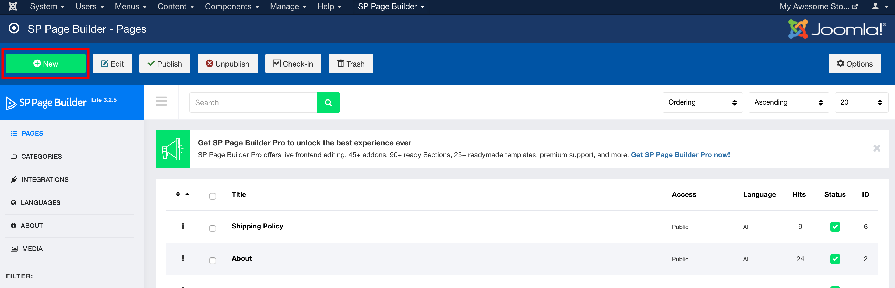
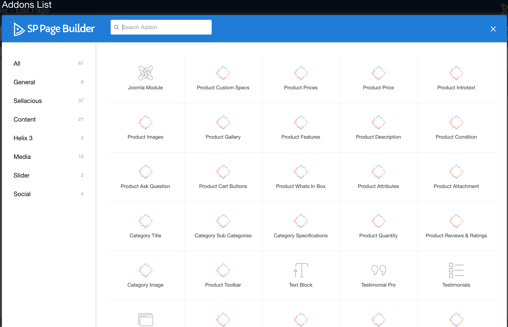
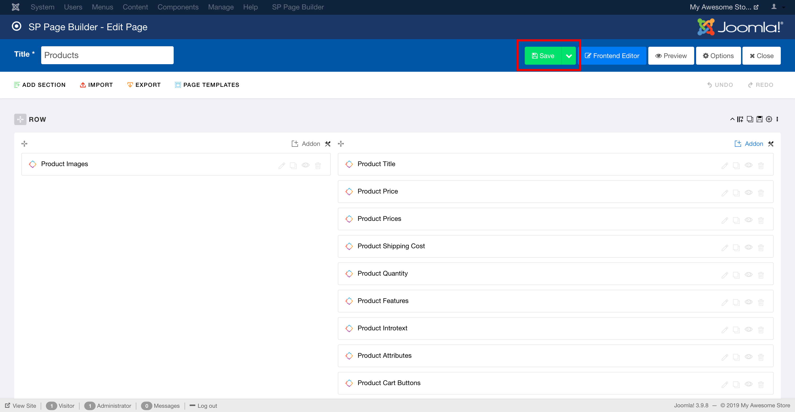

With the help of SP sellacious Addons, you can design your own Product and Category of sellacious.

To use sellacious addons, you need to install SP Page builder. After installing SP Page builder Download Sellacious SP addons from [here](https://www.sellacious.com/resources/sppagebuilder-addons) and install them.  

>In sellacious Templates Quickstart, SP Page builder and addons are already installed.

To Design your own Sellacious Category/Product detail page you need to:

1.  Click on New button to create a new page.

2.  While selecting Add-ons, you'll see sellacious Add-ons. Select one with Product in title if you want to create product details page. Select one with the Category in title, if you want to create page for Category details page.

3. After desiging the pages as you want, save the page.

---

To assign the design you created to products/categories in sellacious [Configure the Sellacious Category Template plugin](https://www.sellacious.com/documentation-v2#/learn/plugins/sellacious-category-template).
