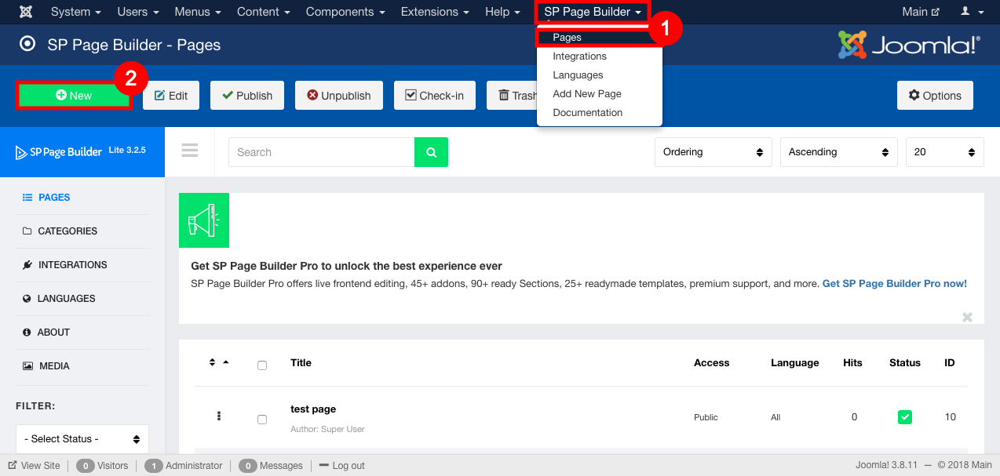
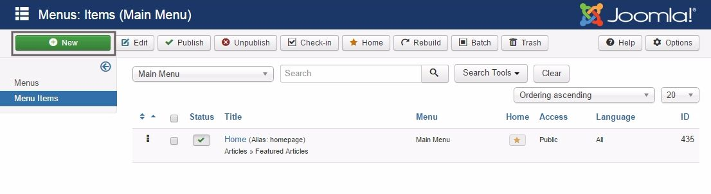
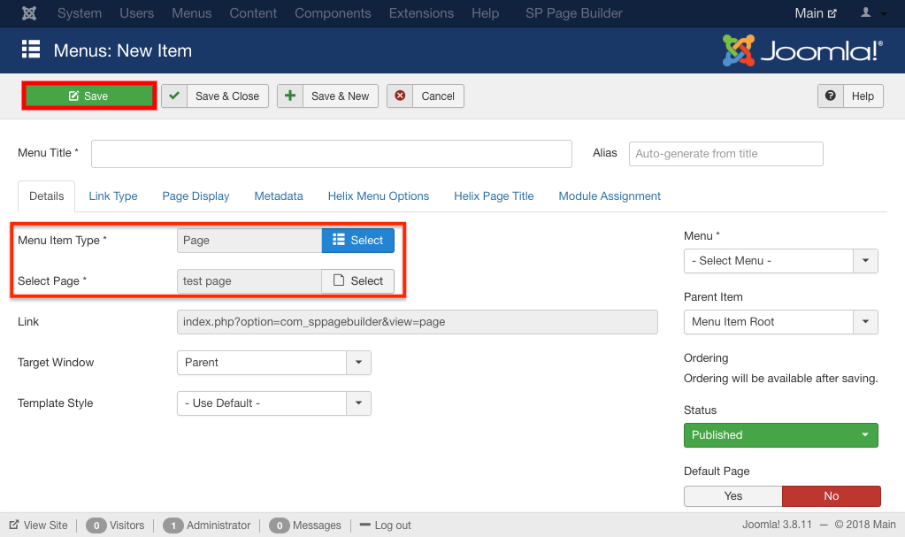
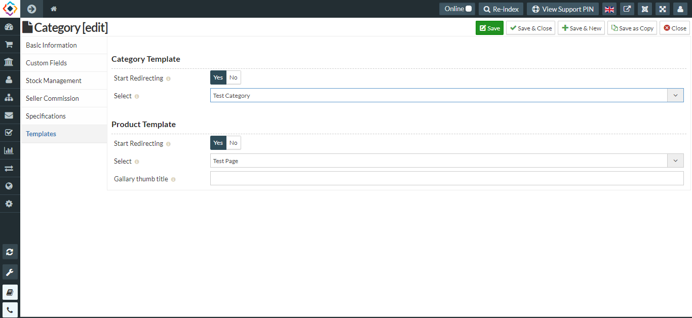
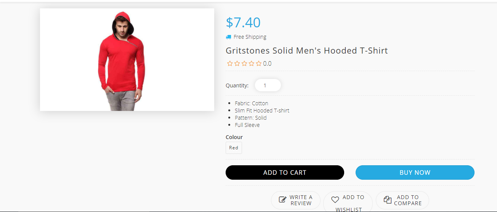

1. Go to the administrator panel of your Joomla website(i.e http://mydomain.com/administrator).
2. Go to **SP Page Builder**, Select **Pages** from the drop down menu.
3. Click on new to create a new page.

4. Give Page a Title and start creating you page.  
5. Click on **Add New Row** to add addons to your page. You can follow [this](https://www.joomshaper.com/documentation/sp-page-builder/sp-page-builder-3) link to know more about SP Page builder Apages and Addons. 

6. Once your pages is created click in save button and save your page.  

7. Go to Menus and create a new menu item under main-menu (or any other desired menu group).

8. Select **SP Page Builder** in Menu Item Type. Select the page you create and save the Menu.

12. In Select page field select the page you created .
13. Click on save to save the changes.

14. You can assign your page layout to your products By to ways-

 a) for all the products in your shop:
   go to **global configration>> Templates**
   Start redirecting **YES**
   Select Category and Product, 
   Save.
   
b) For Products in a particular category
   go to **category>> Templates**
   Start redirecting **YES**
   Select Category and Product  (* you have to make category page in SP Page Builder before you assign ), 
   Save.
   
   
   
Now you can see newly created view of your page

