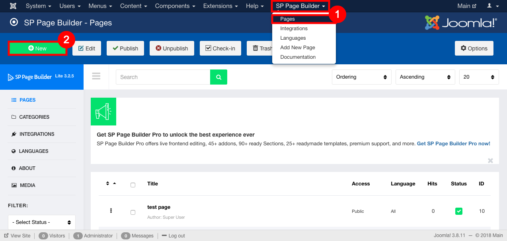

##### **To create a New Page and to link it to a Menu by Using SP Page Builder, Follow Steps:**

1. Go to the administrator panel of your Joomla website(i.e http://mydomain.com/administrator).
2. Go to **SP Page Builder**, Select pages from the drop down menu.
3. Click on new to create a new page.

4. Give a Title to the page, **Title** Text field is mandatory.

5. Edit the page.
6. To edit click on Add New Row Button.
7. Click on **save** to save the page.

8. Go to Menus and create a new menu item under main-menu (or any other desired menu group).

9. Fill the credentials.
10. **Menu Title**, **Menu Item type**, **Select Page** Fields are mandatory.
11. In Menu Item Type select **SP Page Builder**-> **Page.**

12. In Select page field select the page you created .
13. Click on save to save the changes.

14. Now Visit the page you created on your website.
