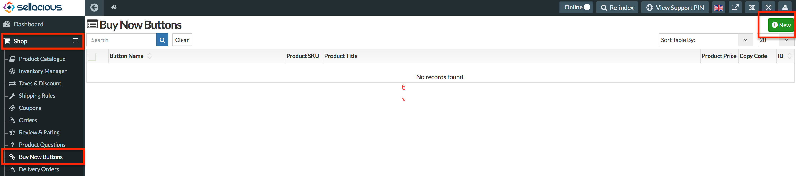
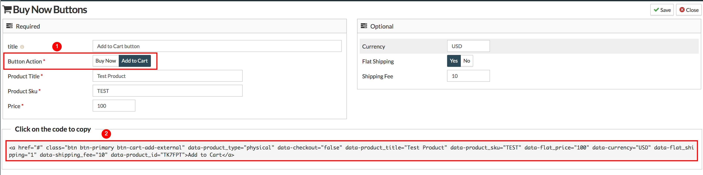

There are two types of Add to Cart buttons in sellacious.  

1. **New Add to Cart Buttons:** For these type of buttons you don't need to create any product in sellacious. You can directly create these buttons from Sellacious Backend.

To create add to cart buttons, go to **sellacious Backend > Shop > Buy Now Buttons**.  

Click on **New** button on the right top of the page to create an Add to Cart Buttons.

The view will open to create sellacious buttons. Fill all the fields.  

* Select **Add to Cart** in button section to create Add to Cart Buttons.
* After submitting all the details, you get a code below the settings. This is the code for the button. 

* Save these settings. Button is created and you can see it in the List.  