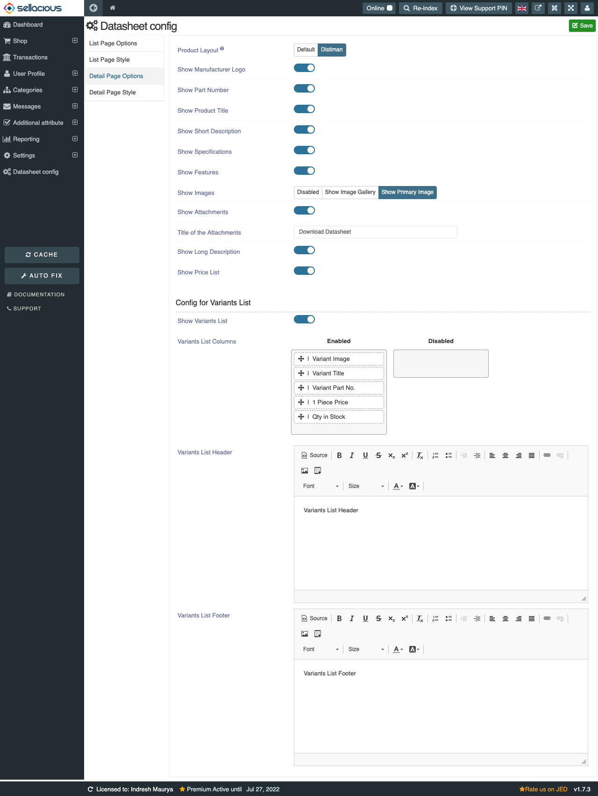

**Written by:** Indresh Maurya
**Date:** 03-08-2020
**Compatibility:** Sellacious v2.0.0-Beta1+

This chapter deals with the Datasheet Component layout and configuration ralated to it. Datasheet enables us to show list page in form of sheet format.

To enable this component follow these steps-

#### Installation

**1.** Install and enable Datasheet component com_sellaciousdatasheet.zip from joomla backend. Go to **Manage->Extention->Install.** 

then go to **Manage->Extention->Manage** and make sure it is enabled

**2.** Now go to **Setings->Global Configuration->Frontend Display Options->Product Options** and select datasheet layout 

#### Cofiguration
Separate view is provided for datasheet configuration which will give options to manage the elements in datasheet list view as well as detail page.

**1.** For that first make a datasheet configuration menu if not done already. To Know more how to make Backofiice menu go to https://www.sellacious.com/documentation-v2#/learn/settings/menu-manager 

**2.** This view provides you option to waht to show and in what order on datasheet list page/details page.

**List Page Options:** You can opt what column to show and ordering of the columns. Note that specifications and cart buttons can't be removed and if all are disabled then all will show. You can choose Part Number elements wheather it is Product SKU, Seller SKU, Seller Name or all.

**List page style:** css of list page can be changed from here and can be reset to default at any time.

**Detail page option:** You can manage detail page element from here 

**Product Layout:** Choose which layout should be used in Product Detail Page.
**Show Manufacturer Logo:**
**Show Part Number:**
**Show Product Title:**
**Show Short Description:**
**Show Specifications:**
**Show Features:**
**Show Images:**
**Show Attachments:**
**Title of the Attachments:**
**Show Long Description:**
**Show Price List:**
**Show Variants List:**
**Variants List Columns:**
**Variants List Header:**
**Variants List Footer:**
