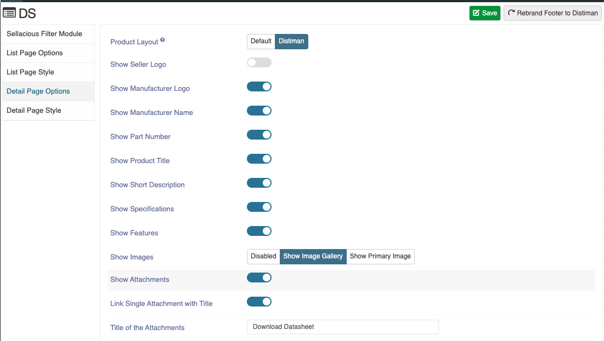
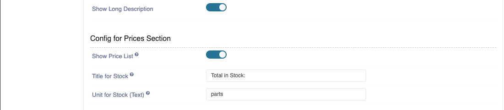
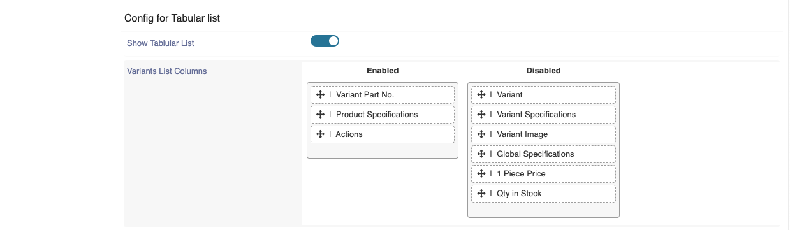

**Written by:** Indresh Maurya
**Date:** 28-10-2020
**Compatibility:** Sellacious v2.0.0-Beta1+

Here are the Datasheet product page configurations-

### Detail page option
You can manage detail page element from here

**Use Settings from:** Here we can decide whether to use global datasheet config for this product or use different product level settings for this particular product.

**Product Layout:** Choose which layout should be used in Product Detail Page.
**Show Seller Logo:** Show/hide seller Logo.
**Show Manufacturer Logo:** Show/hide Manufacturer Logo.
**Show Part Number:** Show/hide Part Number.
**Show Product Title:** Show/hide Product Title.
**Show Short Description:** Show/hide Short Description.
**Show Specifications:** Show/hide Specifications.
**Show Features:** Show/hide Features.
**Show Images:** Choose between galery and primary image for product.
**Show Attachments:** Show/hide Attachments.
**Link Single Attachment with Title:** In case there is single attachment it will show as link.
**Title of the Attachments:** Give Title to the Attachments.

**Show Long Description:** Show/hide Long Description.
**Show Price List:** Show/hide Price List (works only with dynamic pricing).
**Title for Stock:** Choose what should be title of stock.
**Unit for Stock (Text):** Choose what should be unit of stock.

**Show Tablular List:** Show/hide Variants section on details page.
**Variants List Columns:** Choose what Columns to show in variant section.

**Datasheet Default Sorting:** Enables you to set default sorting column for variant section datasheet.
**Datasheet Sorting Direction:** Chose sorting direction (ascending/discending).
**Table Header:** Show/hide List Header.
**Table Header:** Show/hide List Footer.

### Detail page style
css of Detail page can be changed from here and can be reset to default at any time.
