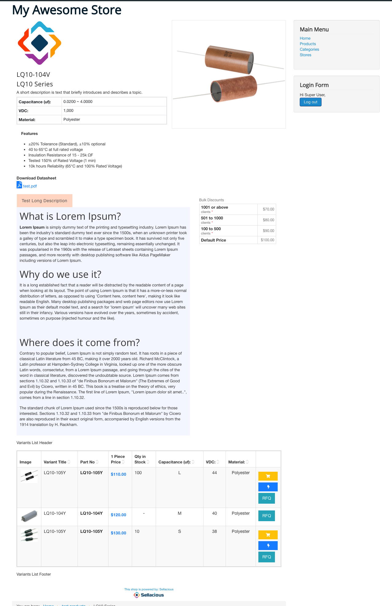
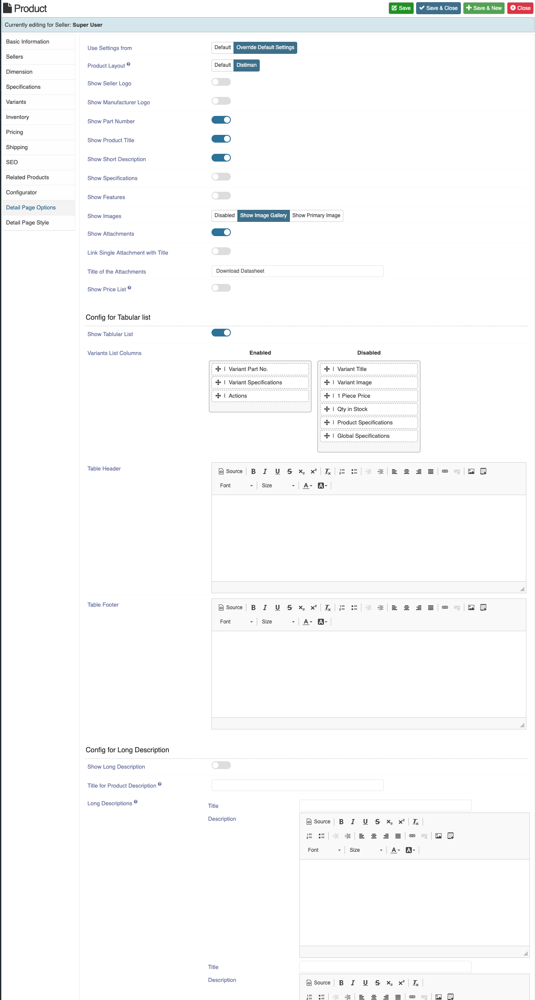

**Written by:** Indresh Maurya
**Date:** 03-08-2020
**Compatibility:** Sellacious v2.0.0-Beta1+

This chapter deals with the Datasheet Component layout and configuration related to it. Datasheet enables us to show list page in sheet format.

To enable this component follow these steps-

## Installation

**1.** Install and enable Datasheet component **com_sellaciousdatasheet.zip** from joomla backend. Go to **Manage->Extention->Install.** 

then go to **Manage->Extention->Manage** and make sure it is enabled

**2.** Now go to **Setings->Global Configuration->Frontend Display Options->Product Options** and select datasheet layout 

## Cofiguration
Separate view is provided for datasheet configuration which will give options to manage the elements in datasheet list view as well as detail page. These configuration can be done on three level
**1. Global Level**
**2. Category Level**
**3. Product Level**

### Global Level

**1.** For that first make a datasheet configuration menu if not done already. To Know more how to make Backoffice menu go to https://www.sellacious.com/documentation-v2#/learn/settings/menu-manager 

**2.** This view provides you option to waht to show and in what order on datasheet list page/details page.

**List Page Options:** You can opt what column to show and ordering of the columns for list page. **Note** List page containing two or more than two categories will show only **Filterable global specifications** and Category list page will show global and category specific(core+variants) specifications. If all options are disabled then all will show. 

Datasheet Default Sorting and sorting direction (ascending/discending) can be chosen.
You can choose Part Number elements wheather it is Product SKU, Seller SKU, Seller Name or all.
Link to product details page can be disabled and can be shown as read only.

Additional options are provided to configure the category page head layout.

**List page style:** css of list page can be changed from here and can be reset to default at any time.

**Detail page option:** You can manage detail page element from here

**Product Layout:** Choose which layout should be used in Product Detail Page.
**Show Seller Logo:** Show/hide seller Logo.
**Show Manufacturer Logo:** Show/hide Manufacturer Logo.
**Show Part Number:** Show/hide Part Number.
**Show Product Title:** Show/hide Product Title.
**Show Short Description:** Show/hide Short Description.
**Show Specifications:** Show/hide Specifications.
**Show Features:** Show/hide Features.
**Show Images:** Choose between galery and primary image for product.
**Show Attachments:** Show/hide Attachments.
**Link Single Attachment with Title:** In case there is single attachment it will show as link.
**Title of the Attachments:** Give Title to the Attachments.
**Show Long Description:** Show/hide Long Description.
**Show Price List:** Show/hide Price List (works only with dynamic pricing).
**Show Tablular List:** Show/hide Variants section on details page.
**Variants List Columns:** Choose what Columns to show in variant section.
**Datasheet Default Sorting:** Enables you to set default sorting column for variant section datasheet.
**Datasheet Sorting Direction:** Chose sorting direction (ascending/discending).
**Table Header:** Show/hide List Header.
**Table Header:** Show/hide List Footer.

**Detail page style:** css of Detail page can be changed from here and can be reset to default at any time.

### Category Level

Option are available in category edit for category list page/category product details page and those options if enabled will apply on produsts of that category only. Also the option is given if you want to choose global layout for the category too. **Note:** If a product is associated with more than one categories, category layout will be ignored and global will be applied.

Additional options are provided to configure the category page head layout.

### Product Level

Option are available to choose Default(Category/Global) layout or Override Default Layout in product edit and those options if enabled will apply on that particular product only and ignore category/global layout.
Additional config is given for adding long description

### Complementary Configurations

**Hide Variants:** By default sellacious selects best price listing of a product and displays it in list view. It can be a seller's product or a variant of main product and when clicked, it redirects to respective product details page rather than main product details page. To always show main product in list page and redirect main product details page, enable Hide Variants from list page section of Frontend display options.

**Hide Variant Specifications:** In specification section of product details page all product related specifications  viz global, product and variant specifications are shown. To hide variant specifications from product details page disable it from Backend Display Options.

**Config to hide placeholder image:** Placeholder image can be hidden from details page if no image is provided. Configuration is provided in frontend display options.

**Config to show manufactures in cart:** Frontend display options config allows you to show manufacturer instead of seller in cart.

